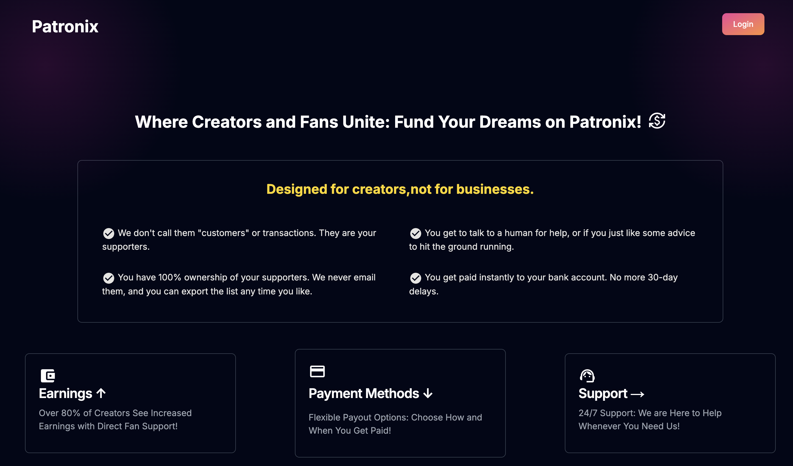
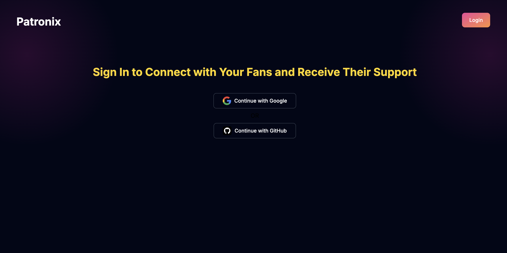
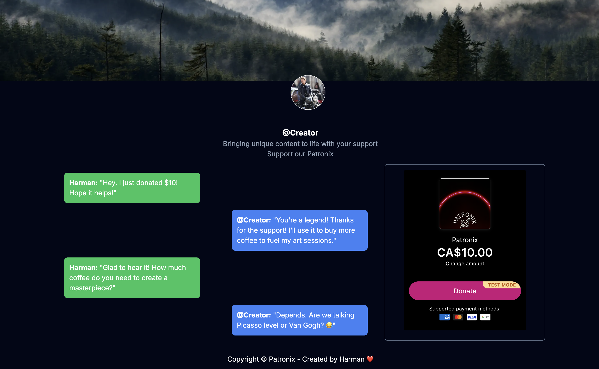

# Patronix



Patronix is a patronage and donation platform built with Next.js, MongoDB, Mongoose, Stripe API, and Tailwind CSS. The platform allows creators to receive support from their audience through a seamless and secure payment system. The app features an intuitive UI and robust backend to manage user data and transactions.

# Features

- User Authentication: Secure login using Google and GitHub OAuth.
  
- Donations: Integrated with Stripe for secure and straightforward payment processing.
  
- Responsive UI: Built with Tailwind CSS for a great user interface and experience.
- Database Management: Utilizes MongoDB and Mongoose for efficient data handling.

# Setup
### Prerequisites
- Node.js and npm installed on your machine.
- MongoDB installed and running on your local machine.

### Installation

1. **Clone the Repository:**
   
```
   git clone https://github.com/{yourusername}/patronix.git
```

2. **Install Dependencies:**
 ```
 npm install
```

3. **Create a .env File:**
Create a .env file at the root of the project and add your environment variables for Mongodb, Google, GitHub authentication, and Stripe.
``` 
GITHUB_ID=your_github_id
GITHUB_SECRET=your_github_secret
GOOGLE_ID=your_google_id
GOOGLE_SECRET=your_google_secret
NEXT_PUBLIC_CREATOR_NAME=your_creator_name
NEXT_PUBLIC_STRIPE_PUBLISHABLE_KEY=your_stripe_publishable_key
STRIPE_SECRET_KEY=your_stripe_secret_key
NEXT_PUBLIC_PAYMENT_LINK="your_payment_link"
MONGODB_URI=your_mongodb_uri
```

4. **Run the App:**
   
```
npm run dev
```
# Contributing
Contributions are welcome! Please fork the repository and create a pull request.

# License
This project is licensed under the MIT License.
